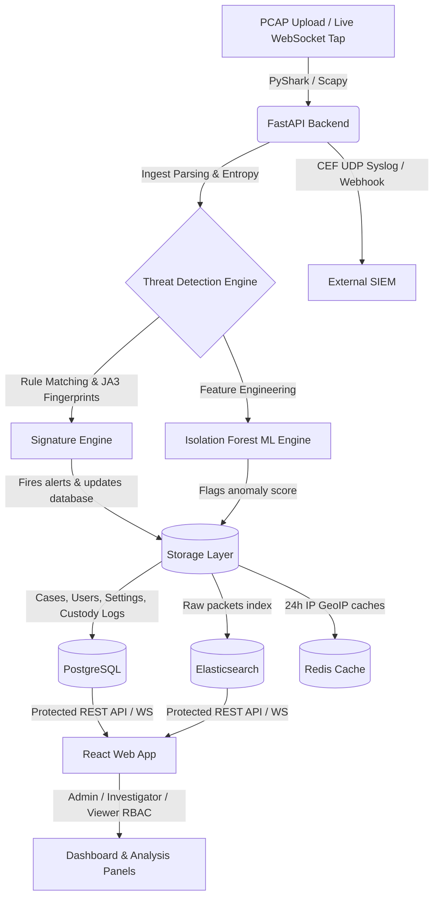

# 🛡️ KanadShield

> **Advanced Digital Forensics, Packet Analysis & Cryptographic Chain of Custody Auditing Platform**  
> Custom-tailored for police department cyber cells, forensic labs, and network security auditors.

## 📐 System Architecture & Flow

The pipeline below shows how PCAPs and live streams are parsed, run through rules/ML, and written to PostgreSQL/Elasticsearch for real-time visualization:



---

## 🚀 Key Features

### 1. Ingestion & Deep Packet Inspection (DPI)
* **PCAP & Keylog Ingest**: Upload standard `.pcap` files along with optional SSL/TLS SSLKEYLOGFILE master secrets to decrypt encrypted TCP payloads.
* **Payload Entropy**: Calculates Shannon Entropy on UDP/TCP/DNS payloads to detect compressed malware archives or encrypted payloads.
* **Protocol Parsing**: Deep inspection of TCP, UDP, ICMP, DNS (subdomain queries), HTTP (headers, hosts, methods), and TLS/SSL versions.
* **Live Network Tap**: Tap real-time network interfaces via container-capable WebSockets.

### 2. Forensic Threat Detection Rules
KanadShield matches packet payloads and aggregates against a robust signature engine:
* **C2 Beaconing**: Calculates the *Coefficient of Variation* (CV) on flow inter-arrival times (IAT) to flag automated periodic heartbeats.
* **Malicious TLS JA3 Fingerprinting**: Computes MD5 hashes of TLS ClientHello parameters and matches them against known abuse.ch intelligence feeds (e.g., Cobalt Strike, Dridex, Emotet, Metasploit).
* **DNS Tunneling Heuristics**: Detects abnormally high Shannon entropy and length in leftmost subdomain labels (MITRE T1071.004).
* **ICMP Covert Channels**: Flags abnormally long ICMP echo packets (MITRE T1095).
* **SYN Floods & Port Scans**: Heuristics for port scanning (detecting >20 targeted ports in 10s) and SYN flood detection (>500 packets in 1s).
* **Large Exfiltration**: Outbound traffic exceeding 50 MB.
* **Suspicious TLD HTTP POST**: Detects HTTP POST requests to domains with suspicious TLDs (e.g. `.xyz`, `.top`, `.pw`, `.ru`).

### 3. Machine Learning Anomaly Detection
* **Isolation Forest Classifier**: Scores sessions dynamically on 5 statistical features (packet sizes, volume, unique destination ports, and payload entropy).
* **On-Demand Training UI**: Train models on fresh baseline data using the built-in ML training panel.

### 4. Interactive Visualizations
* **Network Flow Graph**: Renders network topologies using React Flow. Highlights suspect IPs with colored threat warning states.
* **Packet Timeline**: Display time-series traffic charts using Recharts with sub-second interval selections (`1m`, `5m`, `1h`) and alert indicators.

### 5. Police-Grade Case Management & Forensics
* **MITRE ATT&CK Mapping**: Automatically correlates alerts to MITRE ATT&CK chain tactics.
* **Evidence Zip Export**: Generates a ZIP archive containing the original PCAP, SSL/TLS keylogs, audit manifests, and SHA-256 integrity hash verification files.
* **Multi-Language PDF Reports**: Exports print-ready PDF reports compiled via WeasyPrint. Supports English (`en`), Hindi (`hi`), Gujarati (`gu`), Spanish (`es`), and French (`fr`).

### 6. Cryptographic Chain of Custody & Audit
* **Audit Trail Ledger**: Logs every user action (PCAP uploads, report downloads, system exports) with timestamp, user ID, action, and source IP address.
* **Interactive Custody Timeline**: Visualize the lifecycle of evidence logs chronologically using an interactive verification modal.
* **Exportable Audit Logs**: Export Chain of Custody ledgers in CSV and JSON formats.

### 7. SIEM & Cache Infrastructure
* **CEF Syslog & Webhooks**: Forward alerts to external SIEMs (Splunk, Elastic) using Common Event Format (CEF) over UDP Syslog, or raw JSON webhooks.
* **Redis Threat Cache**: Caches GeoIP resolutions from `ip-api.com` for 24 hours to prevent rate-limit bans, falling back to a deterministic backup and cooldown algorithm.

---

## 🏗️ Technical Stack

* **Backend API**: FastAPI (Python 3.11)
* **Frontend**: React (Vite + Tailwind CSS v4)
* **Database**: PostgreSQL (asyncpg)
* **Ingestion**: Elasticsearch
* **Cache**: Redis

---

## 🏃 Run the System

To build and start the entire Docker container stack:

```bash
docker compose up --build
```

---

## 👥 Access Control Matrix (RBAC)

KanadShield enforces strict role-based access control (RBAC):

| Action / Tab | Administrator (`admin`) | Investigator (`investigator`) | Auditor / Viewer (`viewer`) |
| :--- | :---: | :---: | :---: |
| **Dashboard & Timeline** | ✅ Read/Write | ✅ Read/Write | 👁️ Read-Only |
| **Flow Graph Analysis** | ✅ Full Access | ✅ Full Access | 👁️ Read-Only |
| **PCAP Upload / Decrypt** | ✅ Allowed | ✅ Allowed | ❌ Restricted |
| **Global Custody Log** | ✅ Full Access | ✅ Full Access | ❌ Hidden |
| **Report PDF/ZIP Generation**| ✅ Allowed | ✅ Allowed | ❌ Restricted |
| **SIEM / System Settings** | ✅ Edit Config | ❌ Restricted | ❌ Restricted |
| **ML Model Training** | ✅ Allowed | ❌ Restricted | ❌ Restricted |

> [!IMPORTANT]
> **Default Authentication Credentials (Demo Mode)**
> * **Admin**: `admin` / *(any password)*
> * **Investigator**: `investigator` / *(any password)*
> * **Viewer**: `viewer` / *(any password)*

> [!TIP]
> **Active Port Mappings**
> * Frontend Application: [http://localhost:3000](http://localhost:3000)
> * API Docs (Swagger): [http://localhost:8000/docs](http://localhost:8000/docs)
> * Elasticsearch: [http://localhost:9200](http://localhost:9200)
> * Kibana Portal: [http://localhost:5601](http://localhost:5601)

---

## 📡 API Endpoints Summary

### Authentication
* `POST /api/auth/login` - Authenticate credentials and return JWT bearer token.

### Sessions & Packet Search
* `POST /api/pcap/upload` - Upload PCAP + Keylog; executes signature + ML detection.
* `GET /api/sessions` - Retrieve all uploaded session items.
* `GET /api/packets` - Search packets matching IP, port, time-ranges, payload, or host query.
* `GET /api/sessions/{session_id}/stream` - Reassemble TCP stream payloads.
* `GET /api/sessions/{session_id}/dpi` - Inspect packet hex/byte representation.

### Threat Intelligence & Alerts
* `GET /api/alerts` - List generated alerts.
* `GET /api/threat-intel/{ip}` - Fetch GeoIP & threat score (Redis cached).
* `GET /api/dashboard` - Retrieve aggregated session statistics.

### Cases & Forensics
* `POST /api/cases` - Create an investigation case.
* `GET /api/cases/{case_id}/export` - Generate localized audit PDF.
* `GET /api/evidence/{session_id}` - Download ZIP bundle of forensic materials.
* `GET /api/custody` - Fetch global chain of custody logs.

---

## 🔮 Future Enhancements (Out of Hackathon Scope)

The following features were deliberately deferred due to time constraints. The system's architecture is fully designed to accommodate all of them:

* **TCP Session Reconstruction**: Full Wireshark-style stream reassembly using Scapy's `TCPSession` tracker. Requires stateful packet buffering.
* **Integration with Cyber Crime Branch Systems**: RESTful adapter layer designed but not deployed due to no access to production CC branch APIs. Schema and endpoints ready.
* **Multi-Language Forensic Reports**: WeasyPrint PDF template supports i18n via Jinja2 template variables. Gujarati/Hindi report templates planned.
* **Kafka Streaming**: Production-ready Kafka clustering integrated for high-throughput streaming (active on `live-alerts` and `live-packets` topics).
* **Cloud Deployment**: Platform-agnostic Docker Compose configurations are cloud-ready. Kubernetes Helm charts in `k8s/` directory for GKE/EKS deployment.
* **SIEM Integration**: Elasticsearch index formats are Elastic Common Schema (ECS) compatible, enabling direct ingest into any ECS-compliant SIEM (Elastic SIEM, Splunk ES).


